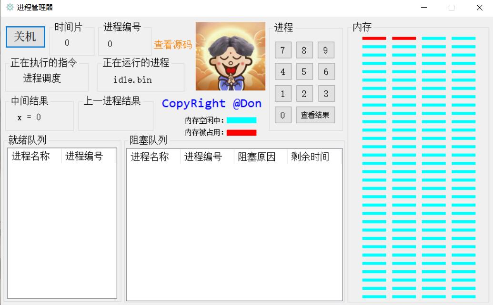
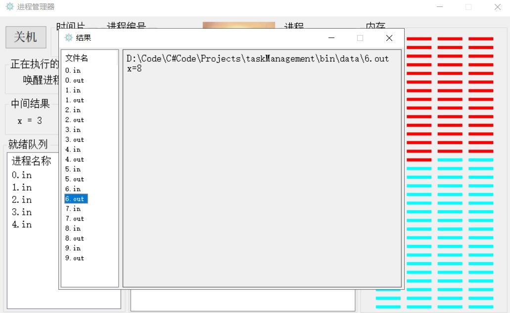

C#程序模拟操作系统进程管理的实现，以加深对操作系统工作原理和操作系统实现方法的理解。
进程管理实验要求实现的功能：①硬件的模拟；②进程调度；③进程的创建和撤销；④进程的阻塞和唤醒；⑤进程中断。

准备10个文本文件，文件里面放以下程序（程序可以相同）：
x=?;   给x赋值一位数
x++;   x加1
x--;    x减1
!??；   第一个？表示阻塞原因A,B，第二个？为一位数，表示阻塞时间（cpu循环次数）；
end.   表示程序结束，其中包括文件路径名和x的值（软中断方式处理）

程序启动后的界面如下： 
 
点击开机按钮后的界面如下： 
 
分配10个进程后的界面如下： 
 
内存分配完后弹出提示，界面如下： 
 
点击查看结果后的界面如下，可以看到运算结果被保存在了.out文件中： 
 
